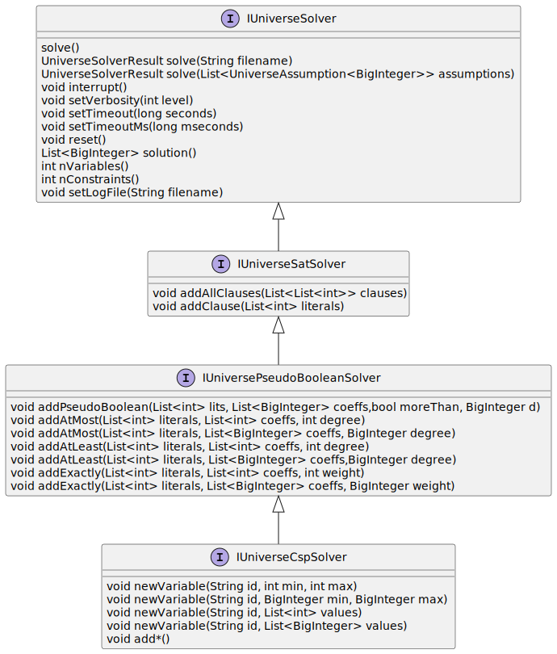
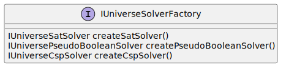

# UNIvERSE - mUlti laNguage unIfied intErface foR conStraint solvErs

[](https://www.gnu.org/licenses/lgpl-3.0.en.html)  [](https://github.com/crillab/universe/actions/workflows/ci.yml)


## Description
 
`UNIVERSE` library proposes generic interfaces for combinatorial problems solvers. 

- [SAT Solver](universe/include/sat/IUniverseSatSolver.hpp)
- [PB Solver](universe/include/pb/IUniversePseudoBooleanSolver.hpp)
- [XCSP Solver](universe/include/csp/IUniverseCspSolver.hpp) 

These interfaces are described in the following diagrams :



`Universe` offers an interface for create Solver. This interface follows the factory design pattern and is described
in the following diagrams: 



## Build

The latest release is available [here](https://github.com/crillab/universe/releases/latest)

`UNIVERSE` is developed using [C++ 17](https://en.cppreference.com/w/cpp/17),
[CMake 3.23](https://cmake.org/).
Installing CMake is required if you want to build from source.
To do so, after having installed all the needed tools, you will need to clone
the project:

```bash
git clone https://github.com/crillab/universe.git --recursive
cd universe
mkdir build
cd build 
cmake .. -DCMAKE_BUILD_TYPE=RELEASE
cmake --build . 
```

## Using CMake

This library is designed for simplified use in projects using CMake. To use this project, it is possible to
create a sub-module in your project with the following commands:

```bash
git submodule add https://github.com/crillab/universe libs/universe
git submodule update --remote --recursive --init
```

And then add the following instructions in your CMakeLists.txt file:

```cmake
add_subdirectory(libs/universe)
add_executable(your_solver solver.h solver.cpp)
target_link_libraries(your_solver universe)
```

## Dependencies 

- [Easy JNI](https://github.com/crillab/easyjni)
- [Magic Enum](https://github.com/Neargye/magic_enum)

